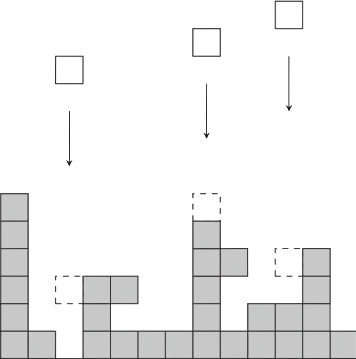
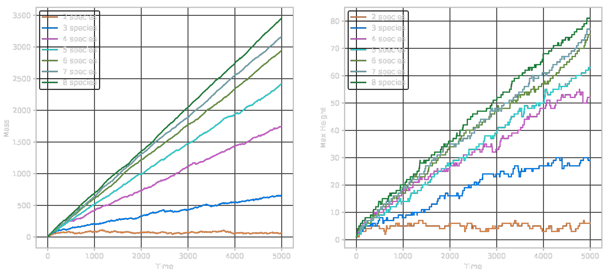
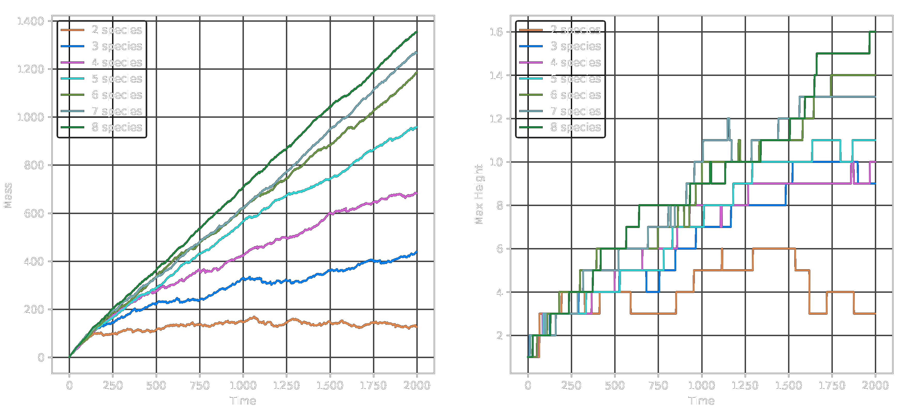

# PuyoPuyo Ballistic Deposition

$\\$

Riz Fernando Noronha

---

<video src="fig/pom_pom_party.mp4" controls autoplay width="100%"></video>

---

### Simplify!

$\\$

- Drop one puyo at a time

- 2 is enough to trigger annihilation

- Choose a random column (no player input!)

---

<iframe width="100%" height="100%" src="https://rizfn.github.io/Sequential-Spatial-Killing/visualizations/puyopuyo" style="border: 1px solid #888888">

</iframe>

---

## Ballistic Deposition

$\\$

- Drop particles one at a time.

- Particles "stick" to other particles, even horizontally!

- Similar to Diffusion Limited Aggregation (DLA).

---

<iframe width="100%" height="100%" src="https://www.youtube.com/embed/d2352OEOWaw?loop=1" style="border: 1px solid #cccccc" frameborder=0></iframe>

---

### Ballistic Deposition: Observations

$\\$

- Fractal-like structures are formed!

- Roughness $w(t)$ increases with a power law with time
  $$w(t) \sim t^\beta$$

- Saturates at a value that has a power-law dependence on system size:
    $$w(L) \sim L^\alpha$$

---

### Ballistic Deposition: Observations

Known to follow the **Kardar-Parisi-Zhang (KPZ)** universality class.

$$\frac{\partial h(x, t)}{\partial t} = \nu \frac{\partial^2}{\partial x^2}h(x,t) + \frac\lambda2\left(\frac{\partial}{\partial x} h(x,t)\right)^2 + \eta(x, t)$$

- Roughness exponent $\alpha = 1/2$

- Growth exponent $\beta = 1/3$

- Dynamic exponent $z = 3/2$

---

### Puyo-Puyo Version

- Now, the puyos can **stick!**

- By killing a puyo, you can potentially create a floating cluster.
  
- Floating clusters "fall" until they stick on to the bottom or another rooted cluster.

---

<iframe width="100%" height="100%" src="https://rizfn.github.io/Sequential-Spatial-Killing/visualizations/puyopuyo" style="border: 1px solid #888888">

</iframe>

---

### 2D: Mass and Height vs Time

---

### 3D: Mass and Height vs Time

---

## Future work

$\\$

Surface Roughness

Rate of eliminations

Rate of floating cluster formation

Optimum number of chains
