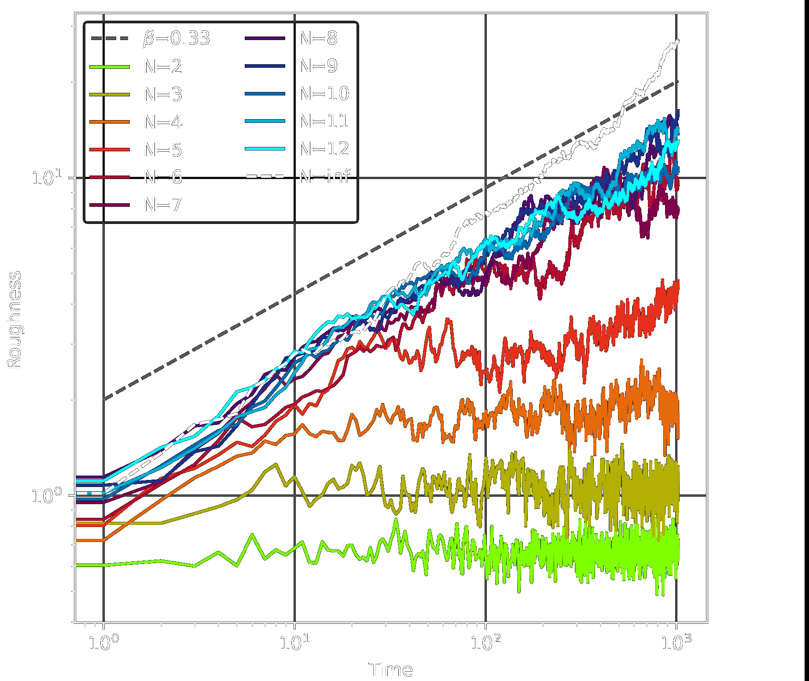

# PuyoPuyo

$\\$

Riz Fernando Noronha

---

<video src="../puyopuyo_apr16/fig/pom_pom_party.mp4" controls width="100%"></video>

---

### Simplify!

$\\$

- Drop one puyo at a time

- 2 is enough to trigger annihilation

- Choose a random column (no player input!)

---

<iframe width="100%" height="100%" src="https://rizfn.github.io/Sequential-Spatial-Killing/visualizations/puyopuyo/gravity" style="border: 1px solid #888888">

</iframe>

---

# 1D Model

$\\$

Largest Cluster = 2

No falling!

Either add or delete each time step

Random walk!

---

Master equation:

$$
\begin{align*}
P(h,\, t) =\, & P(h-1,\, t-1)\cdot\left(1-\frac{1}{N}\right) \\
&+ P(h+1,\, t-1) \cdot\frac{1}{N}
\end{align*}
$$

$\\$

We can derive:

$$
\frac{\partial P}{\partial t} = \underbrace{\left(\frac12\right)}_{\color{#fa99a5}{\boldsymbol{D}}} \frac{\partial^2 P}{\partial h^2} + \underbrace{\left(\frac2N-1\right)}_{\color{#fa99a5}\boldsymbol{-v_d}} \frac{\partial P}{\partial h} \\
$$

---

### 1D Mass/Height vs Time

---

### 2D Mass, Height vs Time

---

### 3D Mass, Height vs Time

---

### Magic Number

$\\$

2D: **6** species can grow

3D: **9** species can grow

4D: **13** species can grow

---

### Magic Number (?)

$\\$

Average ~2 neighbours
Disregard correlations
Assume no avalanches
$P(\text{same})$, $P(\text{different})$

0 drift at 5.4!
(Need to try 3D)

---

### Finite Size Scaling 

$\\$

---

### Avalanches (2D)

1. Number of **clusters** eliminated per 'added puyo'

2. Number of **puyos** eliminated per 'added puyo'

---

### Avalanches (2D)

---

### Sandpile Models

$\\$

The original SOC model

Power-law with exponent $\color{#fa99a5}\boldsymbol{\tau\,}$**=1.5**

Difficult to push to $\tau\,$>2!

---

$\\$

Possibly linked to **bipartite networks**?

Merging donor+reciever is an "emission"

Emissions follow power law, $\tau\,$=3

---

### Roughness (2D)

$\\$

Family–Vicsek scaling only for *growing systems*.

KPZ $\color{#fa99a5}\boldsymbol{\beta}\,$**=1/3** (same!)

---

### Why KPZ-like?

Local slopes must be restricted!

Taller towers are more vulnerable

---

## Future work

$\\$

Length scaling with roughness

Explain magic number in $d$ dimensions

Explore universal scaling

Measure slope distributions

Start from random lattice, then eliminate

Real (undirected 2D model)

Optimum number of chains

Abelian?

